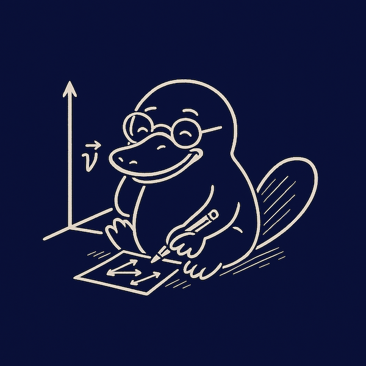

### @scratching-platypus/vector-ts

**Immutable 3D vector type for TypeScript**

A small, explicit, mathematically honest vector utility with predictable behavior.

### Install

```
npm install @scratching-platypus/vector-ts
```

### Import

```TypeScript
import { Vector } from "@scratching-platypus/vector-ts";
```

### Creation

```TypeScript
const v = Vector.from(1, 2, 3);
const w = Vector.fromArray([4, 5, 6]);
```

### Unit Vectors

```TypeScript
Vector.unitX    // Vector(1, 0, 0)
Vector.unitY    // Vector(0, 1, 0)
Vector.unitZ    // Vector(0, 0, 1)
Vector.zero     // Vector(0, 0, 0)
```

### Arithmetic Operations

```TypeScript
Vector.add(a, b);
Vector.subtract(a, b);
Vector.multiply(vector, scalar);
Vector.divide(vector, scalar);
```

### Scalar and Vector Products

```TypeScript
Vector.dot(a, b);
Vector.cross(a, b);
```

### Length and Distances

```TypeScript
vector.length;
Vector.distance(a, b);
Vector.distanceSquared(a, b);
Vector.direction(a, b);
```

### Comparing

```TypeScript
v.equals(w);            // strict equality
v.approxEquals(w);      // tolerant equality
v.isZero();             // zero vector test
```

### Normalization and Negation

```TypeScript
v.unit();       // unit vector
v.normalize();  // alias of v.unit()
v.negate();     // opposite vector
```

### Angles

```TypeScript
v.angleTo(w);          // radians, in [-π, π]
v.angleTo(w, normal);  // oriented radians, in [-π, π]
```

### Rotation

```TypeScript
v.rotate(axis, degrees);    // Rodrigues' rotation formula
```

### Utilities

```TypeScript
v.toArray();   // [x, y, z]
v.toString();  // "[1.00000, 2.00000, 3.00000]"
```
